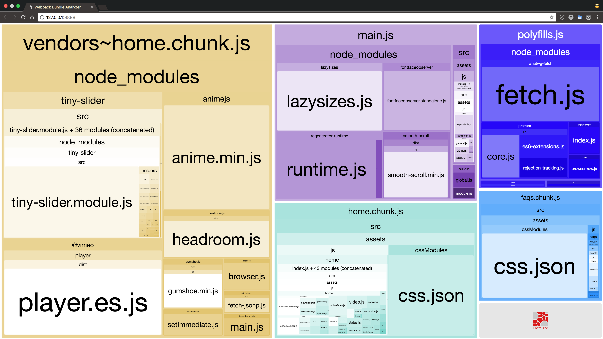

# render-token




## Installing dependencies & running up
To work, the **Pixel2HTML Boilerplate** needs to install some dependencies to run the options you select.
For this job, run this command in your shell

```
$ npm run start
$ npm run code
```

### Other available npm commands

```
$ npm run build // build the project without serving

$ npm run code --tunnel // create a tunnel to share your project everywhere
```

## File Structure

This boilerplate will create a set of files and folders:

```

├── dist/
├── src/
│    ├──  assets/
│    │    ├──  gulp/
│    │    │    ├── tasks/
│    │    │    ├── config.js
│    │    │    └── helpers.js
│    │    ├──  fonts/
│    │    ├──  icons/
│    │    ├──  images/
│    │    ├──  js/
│    │    ├──  styles/
│    │    │    ├──  components/
│    │    │    │    ├──  _buttons.scss
│    │    │    │    ├──  _footer.scss
│    │    │    │    ├──  _forms.scss
│    │    │    │    ├──  _header.scss
│    │    │    │    └──  _nav.scss
│    │    │    ├──  screens/
│    │    │    │    ├──  _base.scss
│    │    │    │    └──  screen_1.scss
│    │    │    │    └──  screen_2.scss
│    │    │    ├──  _variables.scss
│    │    │    ├──  _reset.scss
│    │    │    ├──  _mixins.scss

│    │    │    └──  main.scss
│    │    └──  vendor/
│    └──  screen_1.pug
│    └──  screen_2.pug
├── .editorcofig
├── .gitattributes
├── .gitignore
├── .browserlistrc
├── .babelrc
├── .project.conf
├── gulpfile.js
├── LICENSE
├── package.json
└── README.md
```

## Gulp Config file

You have a config file located at `gulp/config.js` that enables you to add thrid-party libraries easily.

### SCSS Directories

We are using [`sass-module-importer`](https://www.npmjs.com/package/sass-module-importer) so we can import sass libraries just using the npm package name like:

#### Example
```scss
import "bootstrap-sass";
```

That is the external library fits under one of these categories:

* Set a SCSS/Sass/CSS file on the "main" field of their package.json/bower.json
* Set a SCSS/Sass/CSS file on the "style" field of their package.json/bower.json
* Have a index.css file on the root of their module

However fear not, if your module doesn't fit into those categories you can also *navigate* to your desired scss or css file like this:

```scss
@import "module-name/folder/to/_file.scss";
```

### Script Files

We are using [WebpackJS](https://webpack.js.org/) to bundle our script files. There's also ES6 on-demand transpilation and pollyfills.

Learn more about Javascript Modules here [Wesbos Article About Modules](http://wesbos.com/javascript-modules/)

Also learn more about ES6 here: [Babel Overview of ES2015](https://babeljs.io/learn-es2015/)

#### Example
```js
import $ from 'jquery'
import 'bootstrap-sass'
```

We also included the amazing [`webpack-bundle-analyzer`](https://github.com/webpack-contrib/webpack-bundle-analyzer) you can fine tweak you JS bundle size if you wish to. Fire it up running this command:

```sh
$ npm run debug
```

### Font Files

You can add file paths to `fontFiles` key, who will move this fonts to the correct folder `./dist/assets/fonts`.
You can point to specific files or complete directories using wildcards (`**/*`)

#### Example
```
fontFiles: [
  './path/to/bootstrap/fonts/**/*',
  './node_modules/library/font/font.ttf'
]
```

## Available Gulp Commands

### Helpers
* `$ gulp clean` Clean /dist directory

### Images
* `$ gulp images` Move images

### Fonts Files
* `$ gulp fonts` Move project fonts

### Scripts
* `$ gulp scripts` Process script files with webpack

### Styles
* `$ gulp styles` Compile, concat, autoprefix, minify and move [SCSS, Less, Stylus] project files

### Daemons
* `$ gulp watch` **Watch** your files and autoexecute gulp directives
* `$ gulp serve` **Watch** your files and **serve** with an HTTP server and **Sync** with your prefered browser _awesome!_

### Delivery
 * `$ gulp build` Execute all the gulp directives and makes a `.zip` file with the latest code.

### EditorConfig Please note we use
[EditorConfig](http://editorconfig.org/) to help us try to standarize
stuff like tabs spaces and such. Please visit the link provided to
download a plugin for your text editor of choice like Vim, Coda, Atom,
Sublime Text, Visual Studio, Emacs Notepad++ and more.

---

##### Generated with 💕 by Pixel2HTML v2.4.14 @ Tue Mar 13 2018 15:02:55 GMT-0600 (CST)
