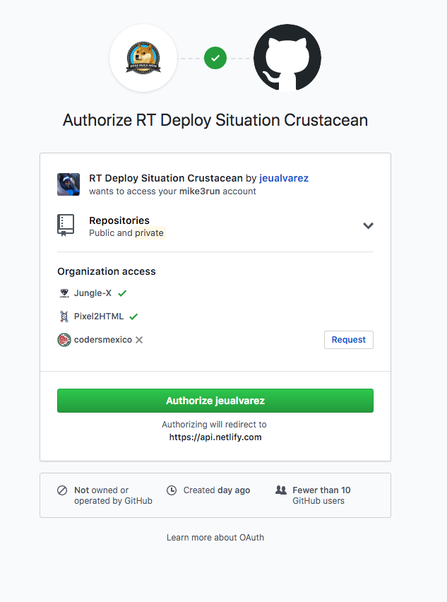

# Tutorial NetlifyCMS

Navigate to [the admin area (click here)](https://render-token.netlify.com/admin/)


Click to authorize


You have to authenticate with Github (only users that can push to the repo can add content)



This is the admin panel is very simple you can add new FAQs Categories and new FAQs Questions...


When adding a new Category you can set its name and order 1-100 in which it will appear on the menu


When adding a new question you can add the title, some content (pictures are okay) you can use Markdown or Rich Text.
Also select a Category which the question belongs to.


This is another example...


Upon saving this will create a new commit on the github repo with the data and the site will update.

## For Developers...

The CMS is adding jsons to `gulp/common/faqs` which we use to transform into HTML

If you won't be deploying with netlify you can also just do:

```
git pull
```

And to build the site:

```
npm run build:normal
```

Then you can publish the `dist` folder anywhere you like like uploading via FTP.

Of course with netlify is much easier and you don't have to do anything.

Much love from Pixel2HTML!
